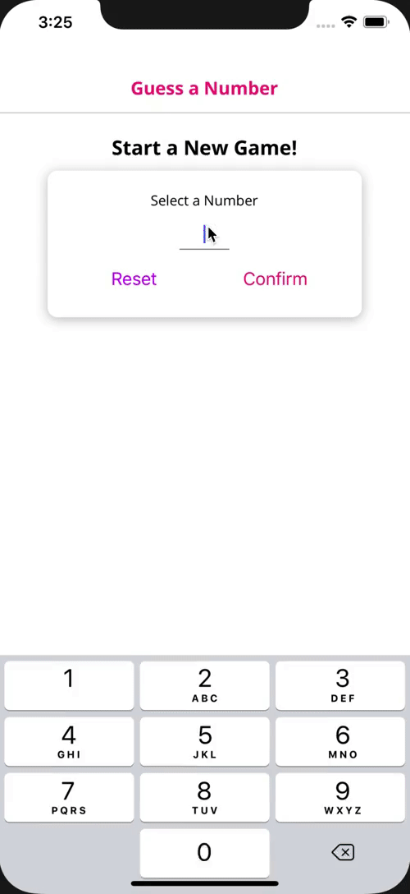

<h1 align="center">
Guess A Number App
</h1>

<p align="center">
<a href="https://www.npmjs.org/package/react-native">
    
  </a>
 </p>
 
&nbsp;

## Contents
- [Requirements](#-requirements)
- [Sample](#-sample)
- [How to use](#-how-to-use)

&nbsp;

## Requirements
If you have not install Expo, install this link [Expo](https://expo.io/learn)

&nbsp;

## Sample


&nbsp;

## How to use
1. Clone this repository.
```
git clone <link>
```

2. Go to the cloned directory (e.g. `cd Guess-A-Number-App`)

3. Run `npm start`

4. Run app on emulator (e.g. `i` for iOS or `a` for Android)
